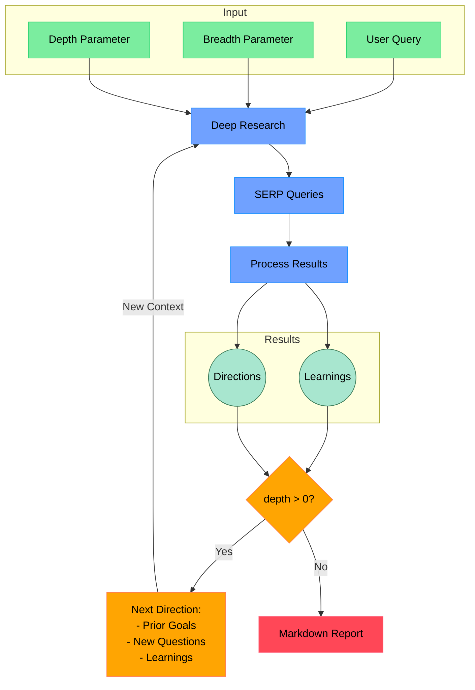

# open-deep-research

[](https://nodejs.org/)
[](https://www.typescriptlang.org/)
[](https://makersuite.google.com/app/apikey)
[](https://mendable.ai/)
[](https://github.com/modelcontextprotocol)
[](https://opensource.org/licenses/MIT)

**Your AI-Powered Research Assistant.**  Conduct iterative, deep research using search engines, web scraping, and **Gemini LLMs**, all within a lightweight and understandable codebase.

This tool uses **Firecrawl** for efficient web data extraction and **Gemini** for advanced language understanding and report generation.

The goal of this project is to provide the *simplest* yet *most effective* implementation of a deep research agent.  It's designed to be easily understood, modified, and extended, aiming for a codebase under 500 lines of code (LoC).

**Key Features:**

* **MCP Integration:** Seamlessly integrates as a Model Context Protocol (MCP) tool into AI agent ecosystems.
* **Iterative Deep Dive:** Explores topics deeply through iterative query refinement and result processing.
* **Gemini-Powered Queries:** Leverages Gemini LLMs to generate smart, targeted search queries.
* **Depth & Breadth Control:** Configurable depth and breadth parameters for precise research scope.
* **Smart Follow-up Questions:** Intelligently generates follow-up questions for query refinement.
* **Comprehensive Markdown Reports:** Generates detailed, ready-to-use Markdown reports.
* **Concurrent Processing for Speed:** Maximizes research efficiency with parallel processing.

## Workflow Diagram



## Persona Agents in open-deep-research

**What are Persona Agents?**

In `open-deep-research`, we utilize the concept of "persona agents" to guide the behavior of the Gemini language models.  Instead of simply prompting the LLM with a task, we imbue it with a specific **role, skills, personality, communication style, and values.** This approach helps to:

* **Focus the LLM's Output:** By defining a clear persona, we encourage the LLM to generate responses that are aligned with the desired expertise and perspective.
* **Improve Consistency:** Personas help maintain a consistent tone and style throughout the research process.
* **Enhance Task-Specific Performance:**  Tailoring the persona to the specific task (e.g., query generation, learning extraction, feedback) optimizes the LLM's output for that stage of the research.

**Examples of Personas in use:**

* **Expert Research Strategist & Query Generator:**  Used for generating search queries, this persona emphasizes strategic thinking, comprehensive coverage, and precision in query formulation.
* **Expert Research Assistant & Insight Extractor:**  When processing web page content, this persona focuses on meticulous analysis, factual accuracy, and extracting key learnings relevant to the research query.
* **Expert Research Query Refiner & Strategic Advisor:**  For generating follow-up questions, this persona embodies strategic thinking, user intent understanding, and the ability to guide users towards clearer and more effective research questions.
* **Professional Doctorate Level Researcher (System Prompt):**  This overarching persona, applied to the main system prompt, sets the tone for the entire research process, emphasizing expert-level analysis, logical structure, and in-depth investigation.

By leveraging persona agents, `open-deep-research` aims to achieve more targeted, consistent, and high-quality research outcomes from the Gemini language models.

## How It Works

## Features

* **MCP Integration**: Available as a Model Context Protocol tool for seamless integration with AI agents
* **Iterative Research**: Performs deep research by iteratively generating search queries, processing results, and diving deeper based on findings
* **Intelligent Query Generation**: Uses **Gemini** LLMs to generate targeted search queries based on research goals and previous findings
* **Depth & Breadth Control**: Configurable parameters to control how wide (breadth) and deep (depth) the research goes
* **Smart Follow-up**: Generates follow-up questions to better understand research needs
* **Comprehensive Reports**: Produces detailed markdown reports with findings and sources
* **Concurrent Processing**: Handles multiple searches and result processing in parallel for efficiency

## Requirements

* [Node.js](https://nodejs.org/) environment (v22.x recommended)
* API keys for:
  * [Firecrawl API](https://mendable.ai/) (for web search and content extraction)
  * [**Gemini API**](https://makersuite.google.com/app/apikey) (for o3 mini model, knowledge cutoff: August 2024)

## Setup

### Node.js

1. **Clone the repository:**

    ```bash
    git clone [your-repo-link-here]
    ```

2. **Install dependencies:**

    ```bash
    npm install
    ```

3. **Set up environment variables:** Create a `.env.local` file in the project root and add your API keys:

    ```bash
    GEMINI_API_KEY="your_gemini_key"
    FIRECRAWL_KEY="your_firecrawl_key"
    # Optional: If you want to use your self-hosted Firecrawl instance
    # FIRECRAWL_BASE_URL=http://localhost:3002
    ```

4. **Build the project:**

    ```bash
    npm run build
    ```

## Usage

### As MCP Tool

To run `open-deep-research` as an MCP tool, start the MCP server:

```bash
node --env-file .env.local dist/mcp-server.js
```

You can then invoke the `deep-research` tool from any MCP-compatible agent using the following parameters:

* `query` (string, required): The research query.
* `depth` (number, optional, 1-5): Research depth (default: moderate).
* `breadth` (number, optional, 1-5): Research breadth (default: moderate).
* `existingLearnings` (string[], optional):  Pre-existing research findings to guide research.

**Example MCP Tool Invocation (TypeScript):**

```typescript
const mcp = new ModelContextProtocolClient(); // Assuming MCP client is initialized

async function invokeDeepResearchTool() {
  try {
    const result = await mcp.invoke("deep-research", {
      query: "Explain the principles of blockchain technology",
      depth: 2,
      breadth: 4
    });

    if (result.isError) {
      console.error("MCP Tool Error:", result.content[0].text);
    } else {
      console.log("Research Report:\n", result.content[0].text);
      console.log("Sources:\n", result.metadata.sources);
    }
  } catch (error) {
    console.error("MCP Invoke Error:", error);
  }
}

invokeDeepResearchTool();
```

### Standalone CLI Usage

To run `open-deep-research` directly from the command line:

```bash
npm run start "your research query"
```

**Example:**

```bash
npm run start "what are latest developments in ai research agents"
```

### MCP Inspector Testing

For interactive testing and debugging of the MCP server, use the MCP Inspector:

```bash
npx @modelcontextprotocol/inspector node --env-file .env.local dist/mcp-server.js
```

## License

[MIT License](LICENSE) - Free and Open Source. Use it freely!

---

**Let's dive deep into research!** 🚀
